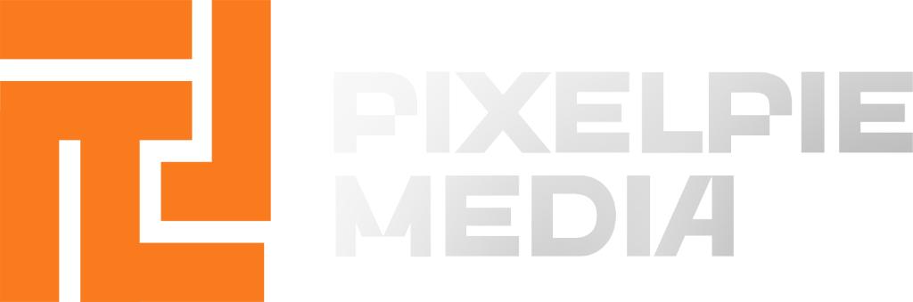

# VocalClean Free 🎙️✨

VocalClean is a high-performance audio transcription and cleaning utility designed for content creators, podcasters, and professionals.

<div align="center">
  
</div>

<p align="center">
  
  
  
</p>

---

## 🚀 Key Features

* **Multi-Pass Transcription**: Transforms raw audio into polished text using Gemini 2 Flash.
* **Dual Transcript Layout**: Generates clean (grammar corrected, filler words removed) and original scripts side-by-side.
* **SRT/VTT Subtitle Engine**: Automatic subtitle extraction matching strict target reading speeds.
* **Aesthetic Dashboard**: Premium glassmorphism UI styled for maximum focus and ease of use.

## 🛠️ Run Locally

**Prerequisites:** Node.js v18+

1. **Install Dependencies**:
   ```bash
   npm install
   ```
2. **Configure API Key**:
   Set `GEMINI_API_KEY` inside `.env.local` to your Gemini API key from AI Studio.
3. **Launch Dev Server**:
   ```bash
   npm run dev
   ```

---

<div align="center">
  <p><b>PixelPie Media</b> • Made with ❤️ by Pickko</p>
  <p><i>Modern, minimal, and precise software utilities.</i></p>
</div>
